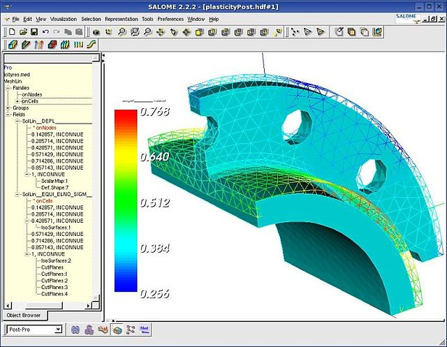
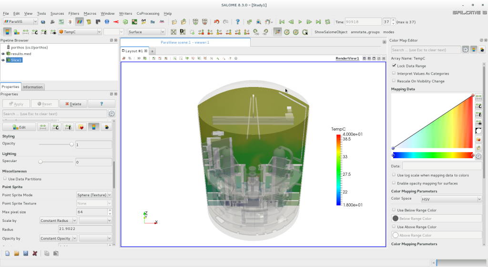
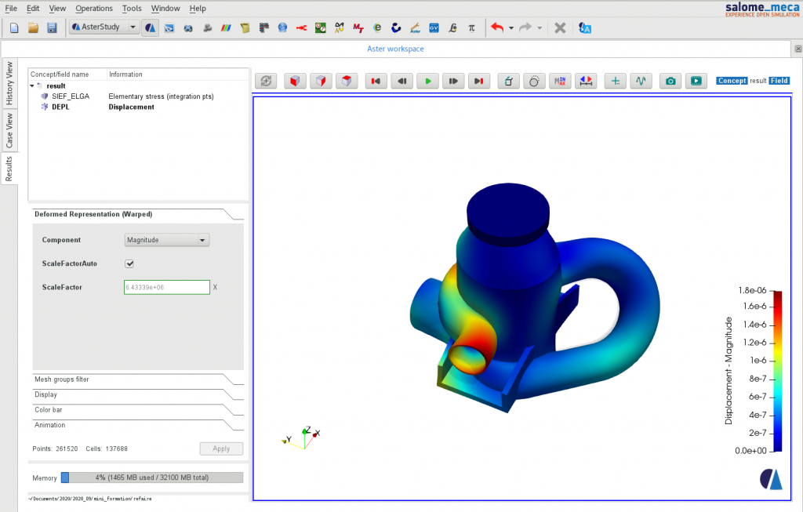
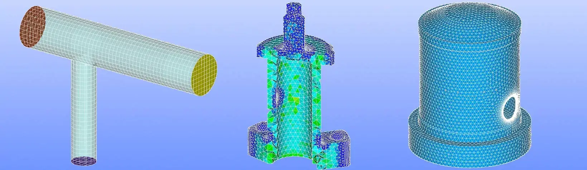
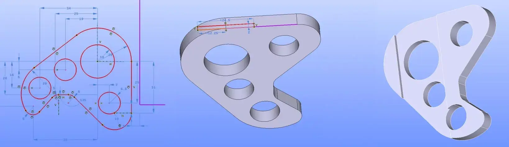
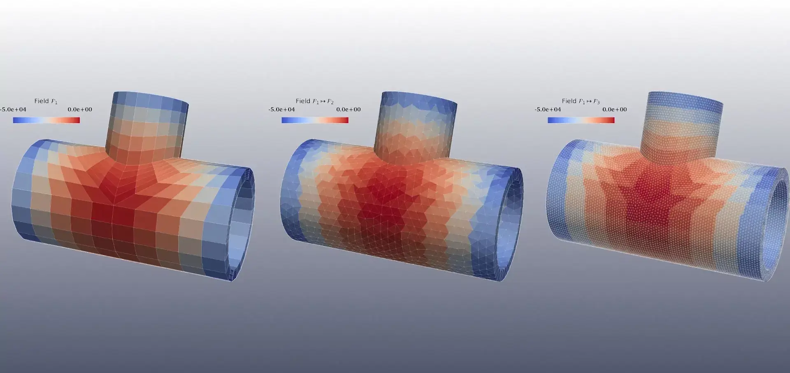

  

<h3 align="center">SALOME Platform</h3>

    The French open-source numerical simulation platform
     
    

        A product developed by:
         
        
        &nbsp;&nbsp;
        
        &nbsp;&nbsp;
        
    

    <a href="https://www.salome-platform.org/">Website</a>
    ·
    <a href="https://discourse.salome-platform.org/">Forum</a>
    ·
    <a href="https://github.com/SalomePlatform/.github/wiki">Wiki</a>

 

# Quickstart

## 1. Installation
- Download precompiled binaries: [Latest Version](https://www.salome-platform.org/?page_id=2433)

## 2. First launch

### Windows users :

Unzip the archive downloaded from [SALOME webiste](https://www.salome-platform.org/?page_id=2433)

Launch SALOME by double clicking on the salome executable.

<!-- TODO ensure this is correct -->

### Linux users :

Tutoriel à venir

 
 

# About SALOME

## Overview
SALOME is a comprehensive platform for numerical simulation, offering:
- CAD modeling
- Mesh generation
- Multi-physics coupling
- Data visualization
- Workflow management

## Screenshot gallery

  
  
  

  
  
  

## Development
SALOME is developed collaboratively by:
- CEA (French Alternative Energies and Atomic Energy Commission)
- EDF (Électricité de France)
- OCC (Open Cascade Technology)

## Documentation
- [User Documentation](https://docs.salome-platform.org/latest/main/gui.html)
- [Developer Documentation](https://docs.salome-platform.org/latest/main/tui.html)

 

# Developper QuickStart

First, follow [The developper installation doc
](https://github.com/SalomePlatform/.github/wiki/SAT)

Then, you can start developping on salome with this first tutorial : [How to contribute to SALOME]()